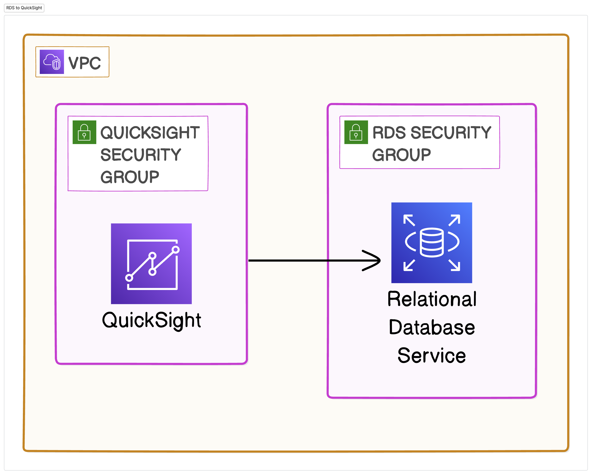
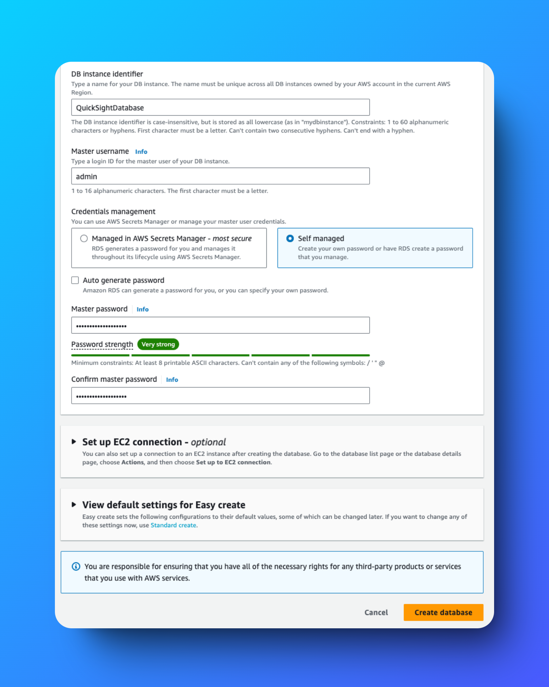
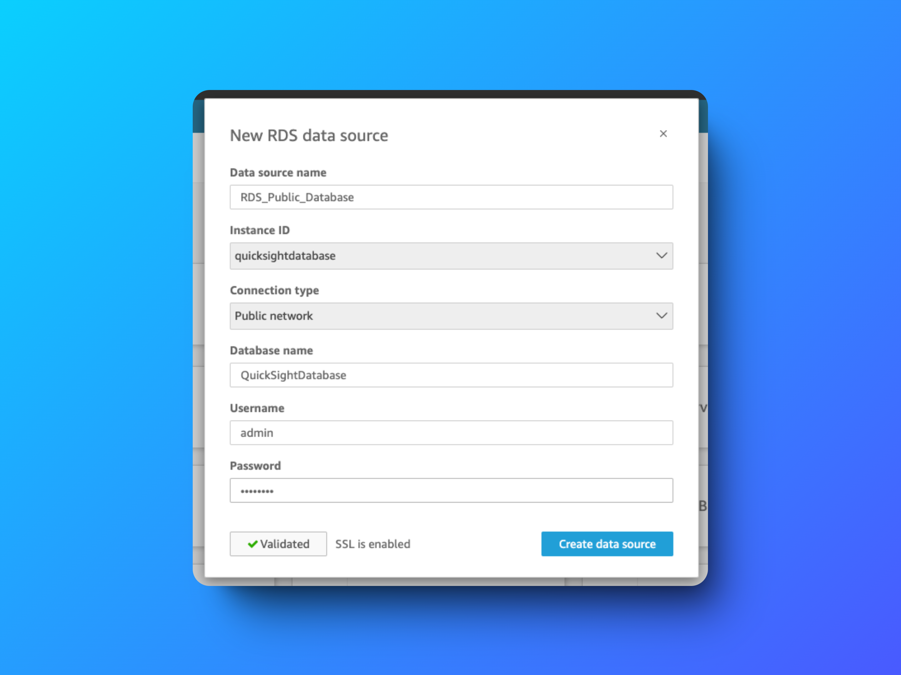
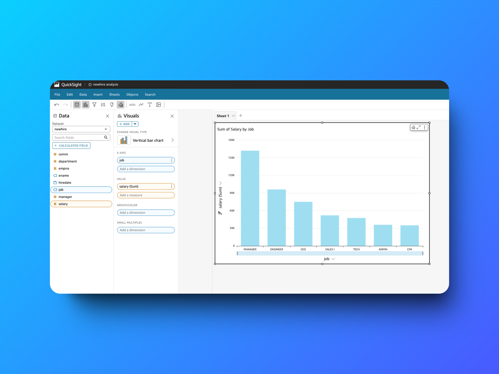

# Visualize a Relational Database with Amazon RDS and QuickSight 📊

---

## 📜 Table of Contents

1. [Project Overview](#project-overview)
2. [Features](#features)
3. [Key Deliverables](#key-deliverables)
4. [Challenges and Lessons Learned](#challenges-and-lessons-learned)
5. [Outcome](#outcome)
6. [Tools and Technologies Used](#tools-and-technologies-used)
7. [Steps to Reproduce](#steps-to-reproduce)
8. [Screenshots](#screenshots)
9. [Acknowledgments](#acknowledgments)
10. [Author](#author)

---

## Project Overview

This project demonstrates the process of setting up and visualizing a relational database using **Amazon RDS** and **Amazon QuickSight**. The primary goal was to create a secure MySQL database, connect it to QuickSight, and produce interactive dashboards for actionable insights. 

---

## Features

- **Relational Database Management**: Built a scalable and secure MySQL instance with Amazon RDS.
- **Data Visualization**: Integrated RDS with Amazon QuickSight to design interactive dashboards.
- **Security Configuration**: Implemented secure communication between RDS and QuickSight with precise IAM roles and policies.
- **Ease of Deployment**: Utilized MySQL Workbench for data manipulation and QuickSight for visualization.

---

## Key Deliverables

1. **RDS Instance Setup**:
   - Created a MySQL database with private access.
   - Configured identifiers, usernames, and passwords for database management.

2. **Data Population**:
   - Populated the database using **MySQL Workbench** with SQL INSERT statements.

3. **QuickSight Integration**:
   - Connected RDS as a data source in QuickSight.
   - Designed dashboards for visual representation of relational data.

4. **Security Enhancements**:
   - Applied strict inbound/outbound rules via security groups.
   - Established private communication protocols for secure data interaction.

---

## Challenges and Lessons Learned

### Challenges
- Configuring security groups for private RDS access without errors.
- Ensuring IAM roles and policies allowed QuickSight to connect securely.

### Lessons Learned
- Private RDS instances enhance security but require meticulous setup.
- Cloud services like QuickSight significantly simplify complex data visualizations.

---

## Outcome

Successfully implemented a **secure database visualization pipeline** using Amazon RDS and QuickSight. The project achieved a balance of robust security and intuitive data insights, aligning with AWS best practices.

---

## Tools and Technologies Used

- **Amazon RDS**: Managed MySQL relational database service.
- **Amazon QuickSight**: Visualization and dashboard creation tool.
- **MySQL Workbench**: Tool for database creation and management.
- **IAM Roles & Policies**: Secure access configuration.

---

## Steps to Reproduce

1. **Create an Amazon RDS Instance**:
   - Use the Easy Create option to configure a MySQL instance.
   - Set private access for enhanced security.

2. **Populate the Database**:
   - Use MySQL Workbench to connect and execute SQL commands.
   - Populate tables with sample data for visualization.

3. **Integrate QuickSight**:
   - Add the RDS database as a data source in QuickSight.
   - Configure security groups to permit inbound traffic from QuickSight.

4. **Design Dashboards**:
   - Create interactive charts and graphs in QuickSight.
   - Apply filters and parameters for detailed data analysis.

5. **Secure the Setup**:
   - Disable public access for the RDS instance.
   - Ensure IAM roles limit permissions to essential actions only.

---

## Screenshots

### RDS Instance Configuration  

### QuickSight Data Source Connection  

### Final Dashboard  

---

## Acknowledgments

Special thanks to **NextWork.org** for providing resources and guidance, and to the AWS community for insights into secure cloud architecture.

---

## Author

**Hassan Gachoka**  
  
  
